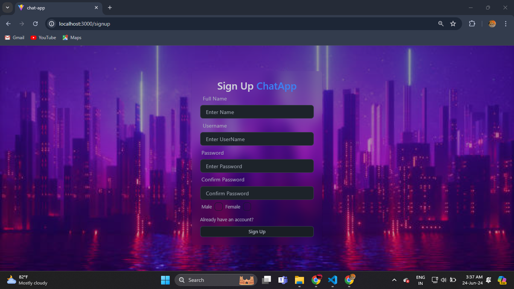
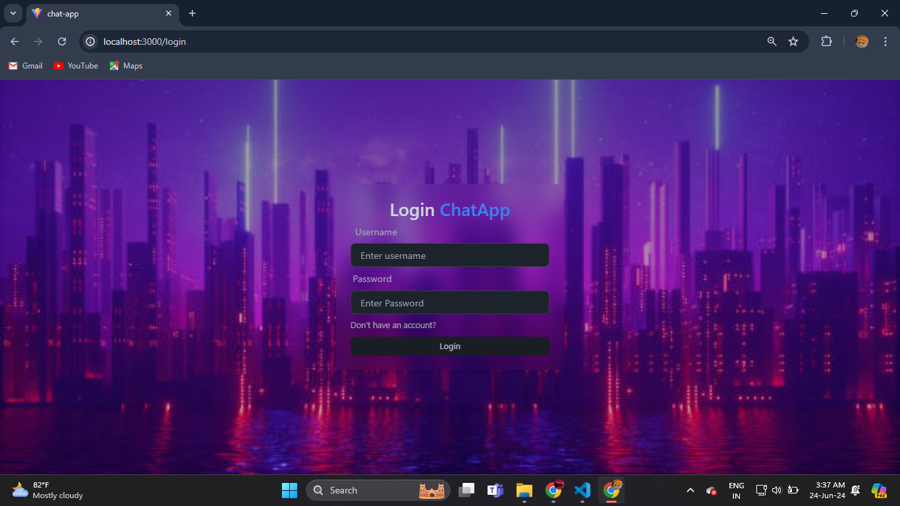
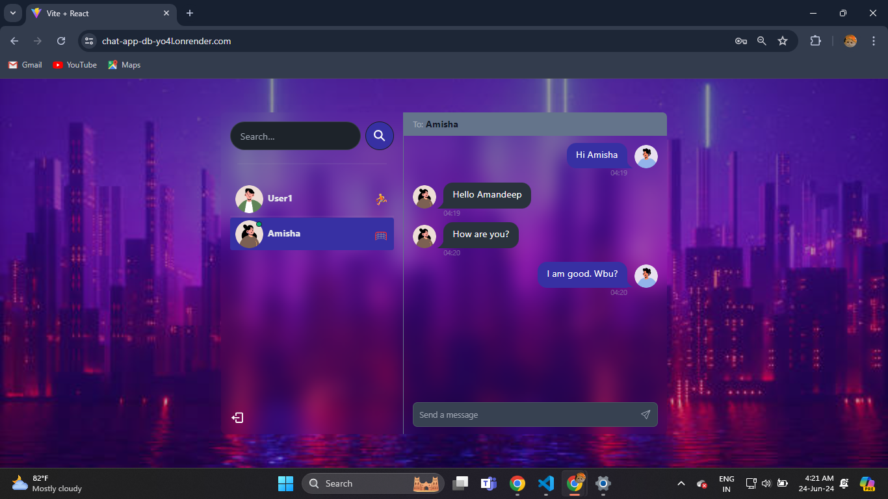

# Real-Time Chat Application using MERN Stack

------description

## Some Features:

🌟 **Tech stack**: MERN + Socket.io + TailwindCSS + Daisy UI  
🎃 **Authentication & Authorization** with JWT  
👾 **Real-time messaging** with Socket.io  
🚀 **Online user status** (Socket.io and React Context)  
👌 **Global state management** with Zustand  
🐞 **Error handling** both on the server and on the client  
⭐ **Deployment** like a pro for FREE!  
⏳ **And much more!**

# User Signup

If the account does not exist, the user will need to sign up:



# User Login

Here is the login page:



# Chat Between Two Users

Below is an example of a chat between two users:



## Setup

### .env file

```dotenv
PORT=...
MONGO_DB_URI=...
JWT_SECRET=...
NODE_ENV=...
