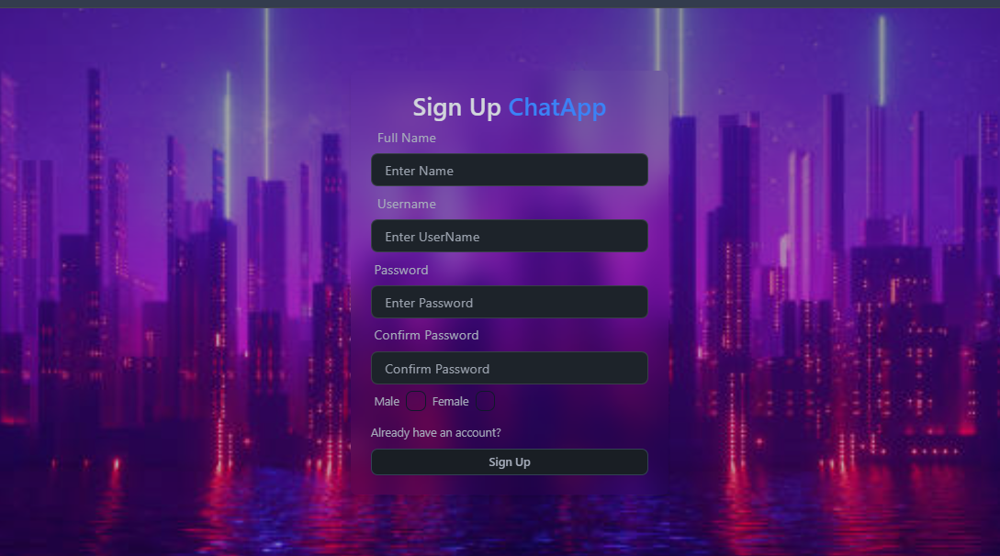
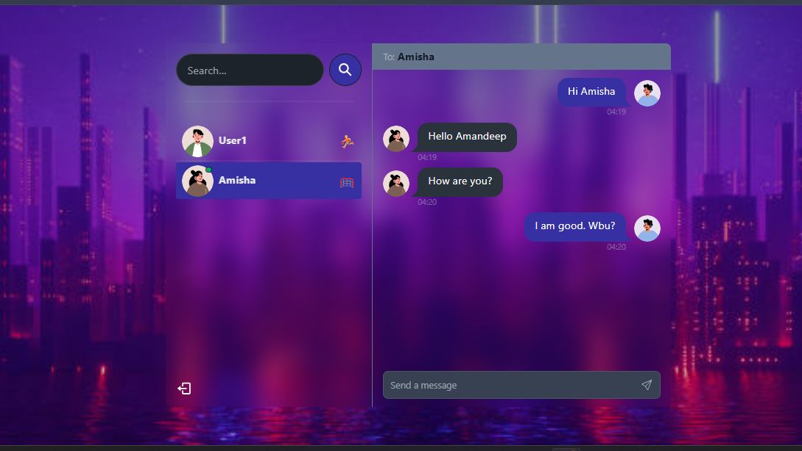

# Real-Time Chat Application using MERN Stack
<br>
## Description
<div style="text-align: justify;">
This project is a real-time messaging application built using the MERN stack, which includes MongoDB, Express.js, React, and Node.js. The application incorporates several additional technologies to enhance the user experience and functionality. Users can sign up, log in, and chat with each other in real-time. Secure authentication and authorization are handled using JSON Web Tokens (JWT). The frontend is designed with TailwindCSS and Daisy UI, providing a modern and responsive user interface. Real-time communication is facilitated by Socket.io, and online user status is managed through a combination of Socket.io and React Context.Global state management is handled using Zustand, making state handling efficient throughout the application. Both server-side and client-side error handling are implemented to ensure a smooth and reliable user experience. The application is easy to deploy, enabling users to set it up like a pro for free. Additionally, it includes many other features to offer a complete messaging experience.
</div>

## Some Features:

🌟 **Tech stack**: MERN + Socket.io + TailwindCSS + Daisy UI  
🎃 **Authentication & Authorization** with JWT  
👾 **Real-time messaging** with Socket.io  
🚀 **Online user status** (Socket.io and React Context)  
👌 **Global state management** with Zustand  
🐞 **Error handling** both on the server and on the client  
⭐ **Deployment** like a pro for FREE!  
⏳ **And much more!**

<br>
<br>
## User Signup

If the account does not exist, the user will need to sign up:


<br>
## User Login

Here is the login page:


<br>
## Chat Between Two Users

Below is an example of a chat between two users:


<br>

## Sockets
<div style="text-align: justify;">
Having an active connection opened between the client and the server so client can send and receive data. This allows real-time communication using TCP sockets. This is made possible by Socket.io.

The client starts by connecting to the server through a socket(maybe also assigned to a specific namespace). Once connections is successful, client and server can emit and listen to events.  
</div>


## RestFUL
<div>
Using HTTP requests, we can use the respective action to trigger every of these four CRUD operations.
-POST is used to send data to a server — Create
-GET is used to fetch data from a server — Read
-PUT is used to send and update data — Update
-DELETE is used to delete data — Delete
</div>


##installation
<br>
### Clone the Repository to your local machine 
```
git clone https://github.com/username/repository.git
```

### Install Dependenciea 


### Setup .env file

```dotenv
PORT=...
MONGO_DB_URI=...
JWT_SECRET=...
NODE_ENV=...
```

### Start the Application


